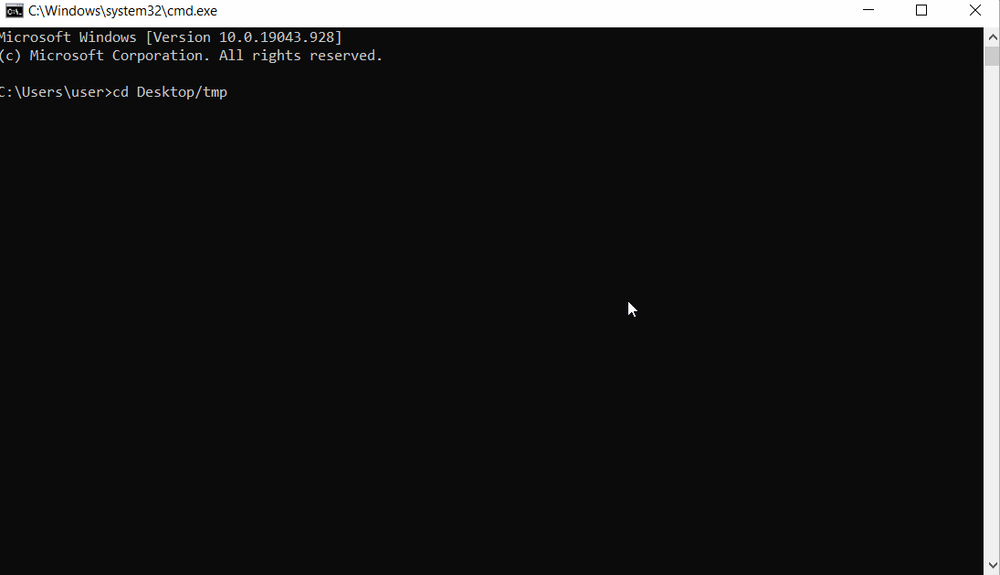

### What is it for?
Fast customizeable menu-by-hotkey in a pie-menu design. 
Can hold up to 12 (default value. You can change it in settings.ini 'max_items') your clipboard items (stored by 'ctrl+c')
Also you can use the menu for fast access to commands (see '[CMD]' section in settings.ini)

### Prerequisites
[Python](https://www.python.org/downloads/)

### Installation
1. Run cmd
2. Go to a folder where the script would be installed ```cd Desktop/tmp```
3. Clone the repo ```git clone https://github.com/awitaminosis/pie_clipboard.git```
4. Create virtual environment```python -m venv pie_clipboard```
5. Go inside ```cd pie_clipboard```
5. Activate virtual environment ```"scripts/activate.bat"```
6. Install requirements ```pip install -r requirements.txt```
7. Run the script ```python main.py```

### Installation Example

